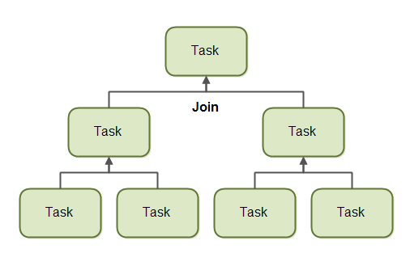

# ForkJoinPool
> `java version 1.8.0_181`<br>
> 引用[原文](http://tutorials.jenkov.com/java-util-concurrent/java-fork-and-join-forkjoinpool.html)

## 概况介绍
在Java 7 中就已经提供了ForkJoinPool, ForkJoinPool和ExecutorService 相似，但有一个区别，ForkJoinPool使任务更加容易拆分为较小的任务，然后再将这些任务提交给ForkJoinPool。只要是能继续拆分的任务，就将其拆分为更小的任务。这点有些抽象，可能不太好理解。接下来详细介绍ForkJoinPool的工作方式以及拆分任务的工作方式

### Fork
> fork 去查中文意思的话，就是“叉子”的意思，这是什么鬼

一个任务可以通过`fork`和`join`原则，将任务拆分为多个更小的子任务，然后让子任务并行执行。如下图所示：


拆分成多个子任务后，每个子任务可以在不同的cpu上并行执行，或者交给不同的线程并行执行。

当然，并不是所有任务都适合拆分的。因为任务的拆分也是需要消耗一定性能的。只有当任务的工作量大到一定程度了，拆分才是有意义的。如果任务本身不大，拆分消耗的性能可能大于拆分后，子任务并行执行带来的收益。

所以，在决定是否需要拆分任务时候，需要指定一个阀值，来明确当前任务是否需要进行拆分。

### Join
> join 中文意思“加入”

当任务被拆分为多个子任务的执行，主任务需要等子任务执行完成。

一旦子任务执行完成，主任务会合并所有子任务的结果到一个大的结果集中。如下图所示：



但是，并不是所有的任务都有结果集返回的。如果子任务没有返回值，主任务只需要等待子任务执行完成，不需要进行结果集的合并。
## 基本使用

### ForkJoinPool
ForkJoinPool 是在Java 并发包下的，一种特殊线程池。这个线程池的设计可以更好的满足任务的Fork/Join模型。

#### work-stealing 
`ForkJoinPool`的任务调度是通过`work-stealing`算法调度的。简单的说，就是空闲线程从忙碌的的线程的队列中“偷走”任务去执行。

默认情况下，工作线程从自己的任务队列头部读取任务执行。当线程队列中没有任务的时候，工作线程会从其他的忙碌线程的队列尾部或者全局任务队列中读取任务。

这种方法最大程度地减少了线程竞争任务的可能性。 由于它首先处理最大的可用工作块，因此还减少了线程寻找工作的次数。
#### 创建 ForkJoinPool
ForkJoinPool开放有构造函数可以直接创建，构造函数只有一个参数，可以指定并行度，明确指定可以有多少线程来执行任务，构造函数创建示例：
```
ForkJoinPool forkJoinPool = new ForkJoinPool(4); // 并行度为4
```
也可以通过静态方法创建对象，如下：
```
ForkJoinPool forkJoinPool = ForkJoinPool.commonPool(); // 根据cpu核数设置并行度
```
#### 任务类型
。`ForkJoinPool`支持两种类型的任务：
1. 无返回值类型的任务，称为`Action`
2. 有返回值类型的任务，称为`Task`

这两种类型的任务的基础类分别为：`RecursiveAction`和`RecursiveTask`。

#### 提交任务
有几种方法，可以提交任务到 `ForkJoinPool` 。

`submit()`或者`execute()`这两个方法使用方式是相同的：
```
forkJoinPool.execute(customRecursiveTask);
int result = customRecursiveTask.join();
```
`invoke()`方法可以启动任务，然后阻塞等待执行结果，并且不需要手动调用`join`:
```
int result = forkJoinPool.invoke(customRecursiveTask);
```
`invokeAll（）`方法是将一组`ForkJoinTasks`提交到`ForkJoinPool`的最方便的方法。 它以任务作为参数（两个任务，动态参数或一个集合），然后`fork`将按照它们产生的顺序返回`Future`对象的集合。

也可以使用单独的`fork()`和`join()`方法。 `fork()`方法将任务提交到池中，但不会触发其执行。 `join()`方法必须用于此目的。 在`RecursiveAction`的情况下，`join`只返回null。 对于`RecursiveTask <V>`，它返回任务执行的结果：
```
customRecursiveTaskFirst.fork();
result = customRecursiveTaskLast.join();
```
### RecursiveAction
一个`RecursiveAction`类型的任务是没返回值的。只是执行某种任务。如：刷盘。

当然了，一个`RecursiveAction`类型的任务，也可能需要继续拆分为更小的任务来执行。

可通过继承`RecursiveAction`来实现自定义任务，如下示例：
```
package fit.ome.jenkov;

import java.util.ArrayList;
import java.util.List;
import java.util.concurrent.RecursiveAction;

public class MyRecursiveAction extends RecursiveAction {

    private long workLoad = 0;

    public MyRecursiveAction(long workLoad) {
        this.workLoad = workLoad;
    }

    @Override
    protected void compute() {

        //if work is above threshold, break tasks up into smaller tasks
        if(this.workLoad > 16) {
            System.out.println("Splitting workLoad : " + this.workLoad);

            List<MyRecursiveAction> subtasks =
                new ArrayList<MyRecursiveAction>();

            subtasks.addAll(createSubtasks());

            for(RecursiveAction subtask : subtasks){
                subtask.fork();
            }

        } else {
            System.out.println("Doing workLoad myself: " + this.workLoad);
        }
    }

    private List<MyRecursiveAction> createSubtasks() {
        List<MyRecursiveAction> subtasks =
            new ArrayList<MyRecursiveAction>();

        MyRecursiveAction subtask1 = new MyRecursiveAction(this.workLoad / 2);
        MyRecursiveAction subtask2 = new MyRecursiveAction(this.workLoad / 2);

        subtasks.add(subtask1);
        subtasks.add(subtask2);

        return subtasks;
    }

}
```
这个例子中，自定义`MyRecursiveAction` 通过构造函数，接收一个任务负载阀值，超过阀值的任务会进行任务拆分。

示例的调用：
```
MyRecursiveAction myRecursiveAction = new MyRecursiveAction(24);

forkJoinPool.invoke(myRecursiveAction);
```
### RecursiveTask
`RecursiveTask` 类型的任务会返回一个结果。如果任务有进行拆分，后续可以对返回结果进行合并。示例如下：
```
import java.util.ArrayList;
import java.util.List;
import java.util.concurrent.RecursiveTask;
    
    
public class MyRecursiveTask extends RecursiveTask<Long> {

    private long workLoad = 0;

    public MyRecursiveTask(long workLoad) {
        this.workLoad = workLoad;
    }

    protected Long compute() {

        //if work is above threshold, break tasks up into smaller tasks
        if(this.workLoad > 16) {
            System.out.println("Splitting workLoad : " + this.workLoad);

            List<MyRecursiveTask> subtasks =
                new ArrayList<MyRecursiveTask>();
            subtasks.addAll(createSubtasks());

            for(MyRecursiveTask subtask : subtasks){
                subtask.fork();
            }

            long result = 0;
            for(MyRecursiveTask subtask : subtasks) {
                result += subtask.join();
            }
            return result;

        } else {
            System.out.println("Doing workLoad myself: " + this.workLoad);
            return workLoad * 3;
        }
    }

    private List<MyRecursiveTask> createSubtasks() {
        List<MyRecursiveTask> subtasks =
        new ArrayList<MyRecursiveTask>();

        MyRecursiveTask subtask1 = new MyRecursiveTask(this.workLoad / 2);
        MyRecursiveTask subtask2 = new MyRecursiveTask(this.workLoad / 2);

        subtasks.add(subtask1);
        subtasks.add(subtask2);

        return subtasks;
    }
}
```

这个示例和`RecursiveAction`除了返回值，基本是一样的。通过泛型，可以看到返回值是`Long`型的。

不同的是，这个示例会进行返回的结果集进行处理。通过调用每个子任务的`join()`方法，获取返回结果，然后合并结果集。

调用结果集：
```
MyRecursiveTask myRecursiveTask = new MyRecursiveTask(128);

long mergedResult = forkJoinPool.invoke(myRecursiveTask);

System.out.println("mergedResult = " + mergedResult); 
```


那么对于`ForkJoinPool`来说是不是尽是点，它又什么不足呢？

## ForkJoinPool 缺点
> 参考[原文](http://coopsoft.com/ar/CalamityArticle.html#faulty)
1.任务管理器有故障